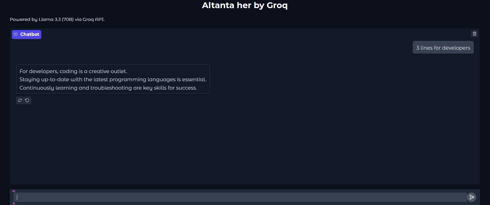
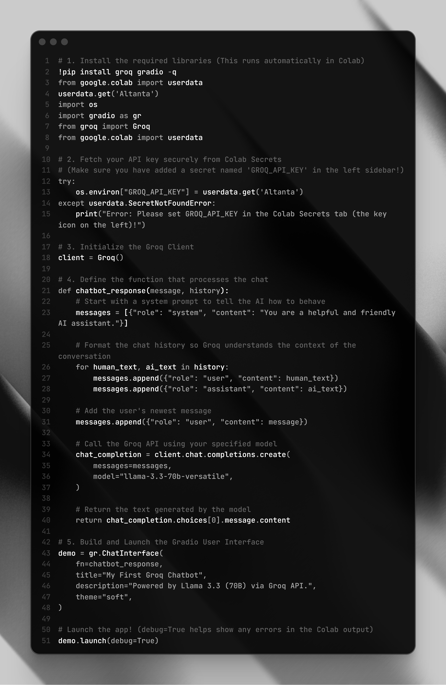

# ⚡ Groq-Powered Chatbot (Llama 3.3 70B)

This is a high-speed AI chatbot built using the **Groq API** and **Gradio**. 

## 🚀 Features
- **Model:** Llama 3.3 70B Versatile
- **Speed:** Powered by Groq's LPU for near-instant responses.
- **UI:** Simple, clean interface via Gradio.
- **Environment:** Designed to run in Google Colab.

## 📸 Screenshots
### The Interface

### The Code

## 🛠️ How to Run
1. Open the code in Google Colab.
2. Add your `GROQ_API_KEY` to Colab Secrets.
3. Run the cells to launch the Gradio interface.
